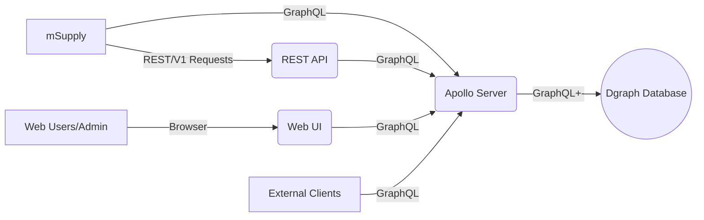

Welcome to the unified-codes wiki!
  
## System Designs
Placeholder overview diagram
<!-- An attempt at creating a diagram in mermaid. Also non-final state (e.g. Auth and external codes are not included here. May be better to replace with drawio diagram. -->

## Development Tools/Resources

* Configs & Scripts [Placeholder]

## API Docs

* Postman public documentation link:  https://documenter.getpostman.com/view/11696795/T1DpBxR9?version=latest
* Postman public collection link : https://www.getpostman.com/collections/cd36b9af86a19c4f1592